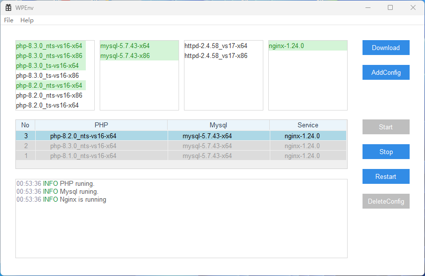

# Integrated Software Suite for PHP, MySQL, NGINX, and Apache

This project provides an integrated software solution for setting up PHP, MySQL, NGINX, and Apache on Windows, developed using Visual Studio 2022.

The environment for developing this program is Windows 11, and it has now been tested and supports running on Windows 7 systems.

## About Use
The program comes with Apache httpd 2.4.58 and nginx 1.24.0 pre-installed.
For PHP and MySQL, manual downloading is required due to their large package sizes.
This can be done by clicking a specific download button within the program.
The download URLs for PHP and MySQL are found in the 'config/service_source.txt' file in the program's root directory.
These URLs are customizable and can be modified as needed.

## PHP Version Compatibility
### Thread Safety Variants
- **TS (Thread Safe):**
  - Primarily compatible with Apache (httpd).
  - Can also run on Nginx, but this is not the optimal setup.
  - Typically, TS is designed for environments where PHP runs as a module of a multithreaded server, like Apache.

- **NTS (Non-Thread Safe):**
  - Specifically compatible with Nginx.
  - Recommended for environments where PHP runs as a FastCGI Process Manager (FPM) or similar, which is common with Nginx.

#### Additional Note on TS with Nginx
- While the TS version of PHP can technically run under Nginx, it's important to note that this might not be the best choice.
- The TS version is optimized for running in a threaded environment, which is how Apache operates.
- Nginx, however, typically works with PHP in a FastCGI setup, where the NTS (Non-Thread Safe) version is more efficient due to its design for non-threaded environments.

## PHP Version and Visual C++ Dependency

### Understanding PHP Version Suffixes
- PHP versions are often followed by suffixes like `vs16`, `vc15`, `vc14`, or `vc11`. These refer to the version of Visual C++ compilers used to build that PHP version. It's crucial to have the corresponding Visual C++ runtime libraries installed on your system to run PHP smoothly.

### Required Visual C++ Runtimes
- **vs16:** Requires Microsoft Visual C++ Redistributable for Visual Studio 2019.
- **vc15:** Requires Microsoft Visual C++ Redistributable for Visual Studio 2017.
- **vc14:** Requires Microsoft Visual C++ Redistributable for Visual Studio 2015.
- **vc11:** Requires Microsoft Visual C++ Redistributable for Visual Studio 2012.

Ensure that you install the appropriate Visual C++ Redistributable version corresponding to the PHP version you are using. This is essential for the proper functioning of PHP on your system.

### Understanding Architecture Suffixes in PHP Downloads
- PHP package filenames often end with `x64` or `x32` suffixes. These indicate the architecture compatibility of the PHP version.

### Choosing the Right Architecture
- **x64:** Stands for 64-bit architecture. Choose this version if you are running a 64-bit operating system. This version can handle larger amounts of memory and is typically more efficient on modern hardware.
- **x32:** Refers to 32-bit architecture (also known as x86). Choose this version if you are running a 32-bit operating system. It's compatible with older hardware and systems with less memory.

## Application UI

## Required Dependencies

For development, you need to install the following packages with vcpkg:

- curl:x64-windows
- jansson:x64-windows
- minizip:x64-windows
- openssl:x64-windows

## License
This project is licensed under the MIT License. See the LICENSE.md file for details.

## Acknowledgements

This project is primarily developed using Visual Studio 2022. We also use tools from the JetBrains All Products Pack to support various aspects of our development workflow.

This project is supported by [JetBrains](https://www.jetbrains.com/).

