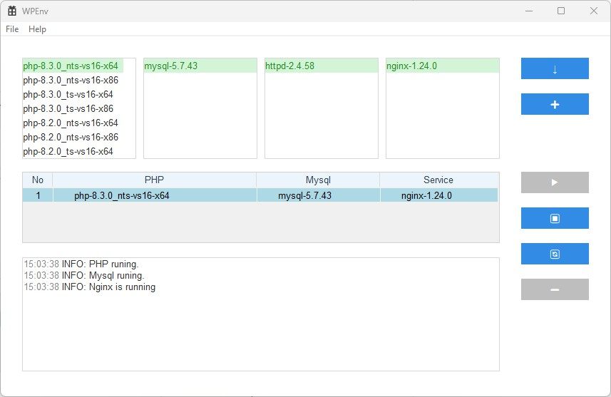

# Integrated Software Suite for PHP, MySQL, NGINX, and Apache

This project provides an integrated software solution for setting up PHP, MySQL, NGINX, and Apache on Windows, developed using Visual Studio 2022.

System environment windows11

## Extensions
Dependencies(vcpkg)

curl:x64-windows
jansson:x64-windows
minizip:x64-windows
openssl:x64-windows
zlib:x64-windows

## Application UI

## License
This project is licensed under the MIT License. See the LICENSE.md file for details.
