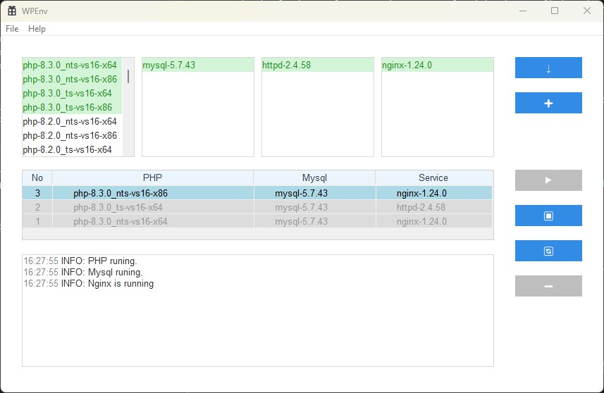

# Integrated Software Suite for PHP, MySQL, NGINX, and Apache

This project provides an integrated software solution for setting up PHP, MySQL, NGINX, and Apache on Windows, developed using Visual Studio 2022.

The environment for developing this program is Windows 11, It has not yet been tested for running on Windows 10 or Windows 7 systems.

## About Use
The program comes with Apache httpd 2.4.58 and nginx 1.24.0 pre-installed.
For PHP and MySQL, manual downloading is required due to their large package sizes.
This can be done by clicking a specific download button within the program.
The download URLs for PHP and MySQL are found in the 'config/service_source.txt' file in the program's root directory.
These URLs are customizable and can be modified as needed.

## PHP Version Compatibility
### Thread Safety Variants
- **TS (Thread Safe):**
  - Primarily compatible with Apache (httpd).
  - Can also run on Nginx, but this is not the optimal setup.
  - Typically, TS is designed for environments where PHP runs as a module of a multithreaded server, like Apache.

- **NTS (Non-Thread Safe):**
  - Specifically compatible with Nginx.
  - Recommended for environments where PHP runs as a FastCGI Process Manager (FPM) or similar, which is common with Nginx.

#### Additional Note on TS with Nginx
- While the TS version of PHP can technically run under Nginx, it's important to note that this might not be the best choice.
- The TS version is optimized for running in a threaded environment, which is how Apache operates.
- Nginx, however, typically works with PHP in a FastCGI setup, where the NTS (Non-Thread Safe) version is more efficient due to its design for non-threaded environments.

## Extensions
Dependencies(vcpkg)

curl:x64-windows  
jansson:x64-windows  
minizip:x64-windows  
openssl:x64-windows  

## Application UI

## License
This project is licensed under the MIT License. See the LICENSE.md file for details.
